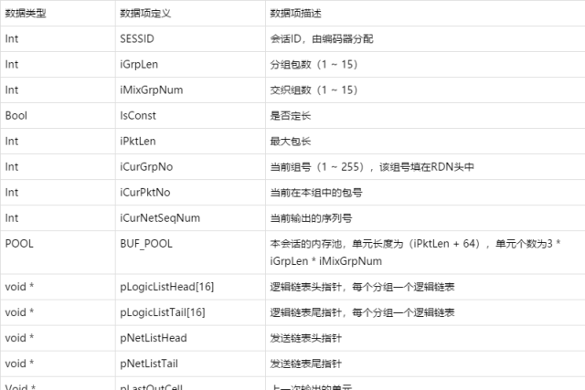

# 1、IP视频通话中丢包造成的影响  

在IP视频通话中，即使是在丢包率很小的情况下也会对视频效果造成较为明显的影响，明显影响用户体验。  

对视频质量的影响主要有：马赛克现象、图像的某些区域不清晰、图像模糊、视音频不同步、帧率下降、图像静止等等。对音频质量的影响包括：总体音频失真、间断或间歇性噪音、音频中断等。  

另外，丢包还会引起过度延迟，甚至是通话中断。  


# 2、LPR (或称丢包恢复)  

LPR (或称丢包恢复)是一种算法，其目的是保护IP视频通话免受网络丢包的影响。  

LPR采用一种差错恢复方法，由发送方系统为发出的数据流添加冗余数据，使接收方系统可以侦测并纠正错误，而无需请求发送方系统重新传送丢失的信息。理论依据是：以数据包恢复的“信道编解码”算法提供稳定的音视频通信质量，远比试图隐藏丢包造成的影响（差错隐消）所产生各种问题（马赛克、画面静止、声音中断等）困扰的视频通信要好得多。  


# 3、简单的RTP冗余算法的原理  

  

1. 对于定长会话，直接将分组中的应用层包异或得到冗余包，恢复时将冗余包与其余包异或得到丢失的包。即：A ^ B = C，则A = B ^ C。
2. 对于变长会话，首先找到本分组的最大包长。小于最大包长的包后面补零再异或得到冗余包。恢复时将冗余包与其余包补零后异或得到丢失包，再去掉多余部分即可。  


# 4、通信协议设计  

```console
SESSID（16）、GrpNo（8）、PktNo（4）、NetSeqNum（16）、PktLen（16）、GrpLen（4）、MixNum（4）、Const（1）、RDN（1）、Marker（1）

应用层数据包格式：

定长冗余包格式与应用层数据包相同。

变长冗余包格式：

RDN_HEAD格式：

RDN_H: 协议标识，5bit，恒定为11011

C: 定长标识，1bit，1表示定长，0表示变长

R: 是否冗余包，1bit，1表示冗余，0表示正常数据包

M: Mark标志，1bit，1表示一组分组和交织中最后一个包

GrpLen: 分组中应用层包的个数，4Bit，1 ~ 30

MixNum: 交织时的组数，4Bit，1 ~ 30

PktLen: 包长，对于数据包，为应用层包长，对于冗余包，为冗余包长

GrpNo: 分组组号，8 bit，0 ~ 255循环

PktNo：分组中包号，4bit，从0开始，冗余包也排号。

NetSeqNum： 实际输出的序列号

SSESSID: 会话编号，用于区分不同会话，由编码侧产生。

RDN_HEAD定义语法（基于小头Little Endian）：根据通信协议自己定义
```

# 5、内部数据结构设计  

## 内存单元：BUF_CELL  

描述：编码时保存每个应用层包和冗余包的结构，编码过程只需传递地址， 不需内存拷贝;  

```c++
//数据结构：
typedef struct tagBufCell
{
    void * pNetPre;
    void * pNetNext;
    void * pLogicPre;
    void * pLogicNext;
    RDN_HEAD rdnHead;
    unsigned char szPkt[4];
}BUF_CELL;
```

说明描述：  
  


## 内存池  

由BUF_CELL组成，每个单元长度 = 应用层包最大长度 + 64，每个编码句柄单独维护一个内存池。
BUF_POOL：  
  


## 逻辑链表（LogicList）与网络发送链表（NetList）  

所有内存单元以两种方式组织：逻辑链表和网络发送链表。逻辑链表按照交织前顺序，即应用层包序；网络发送链表按照交织后顺序，即冗余编码后的输出顺序  

  

## 编码上下文：RdnEncContext  

描述每个编码会话的属性，并管理编码器内部内存。在创建编码器时分配内存并初始化。  
  


## 编码缓冲与输出策略：  

1. 每次传入的应用层包时，先在CelPool中申请一个单元，将应用层包内容填入，并加入LogicList。
2. 当每一个分组的LogicList链表长度为GrpLen时，申请单元，计算并填入冗余
3. 当缓存的分组数达到iMixGrpNum时，交织，重新构造输出链表NetList
4. 在每次编码函数调用时，依次输出两个上一分组交织后的包，即NetList链表中的包
5. NetList中包输出完时，释放所有链表中所有内存单元，将链表指针清空。  

  


## 解码过程：

1. 根据RDN_HEAD中的NetSeqNum进行包序重排
2. 将重排后的包按组号（GrpNo）和包号（PktNo）重组
3. 重组后对每个分组进行恢复（丢失一个包可恢复，两个则不能恢复）
4. 输出  


# 接口函数设计  

```c++
//说明：创建一个冗余编码器句柄
1. RdnEncContext *rdnEncCreateSess(IN Int iGrpLen, IN Int iMixGrpNum,IN Bool IsConst, IN Int iPktLen）;

//说明：冗余编码
2. Int rdnEncode(IN hRdnEnc, IN unsigned char * pAppPkt,IN Int iLen, OUT unsigned char ** ppEncodedPkt[],INOUT Int * piPktNum);

//说明：销毁冗余编码器
3. Int rdnEncClose(IN hRdnEnc);

//创建冗余解码器
4. RdnEncContext *rdnDecCreateSess()

//说明：冗余解码
5. Int rdnDecode(IN hRdnDec, IN unsigned char * pRdnPkt,IN Int iLen, OUT unsigned char ** ppAppPkt[],INOUT Int * piPktNum);

//说明：销毁冗余解码器
6. Int rdnDecClose(IN hRdnDec);
```