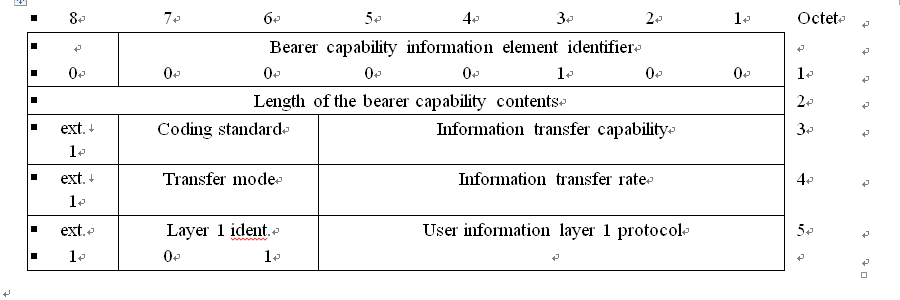
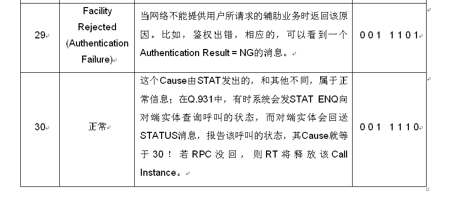

### 1 Q.931及Q.921概述  
#### 1.1 第二层和第三层提供的功能及接口  

Q.931标准描述的是D通道第三层的各种功能，说明了在ISDN用户-网络接口处的网络层呼叫建立、进行及拆线的过程。所有这些过程都是以基本传输速率或基群传输速率通过D-信道的消息交换方式实现的。**Q.931标准介绍了通过D-信道的一个呼叫控制的基本特征、过程及所需要的信息**。  

第三层是利用数据链路层提供的功能和服务来实现其功能的。  
数据链路层提供的服务概括如下：  

* 建立D通路上的数据链路连接
* 数据的防差错传输
* 重新建立数据链路连接（指示信息丢失）

第三层执行的功能主要包括以下各项：  

* 处理与数据链路层通信的原语
* 产生和解释同层通信的第三层消息
* 管理呼叫控制过程中使用的定时器和逻辑实体
* 接入资源的管理，包括对B通道的管理
* 保证所提供的业务与用户要求一致性的检查（例如承载能力）
* 另外，第三层的功能还包括：选路和中继、传递用户和网络间的信息等。

三层和相邻层的接口：ISDN用户－网络接口第三层服务接入点（SAP）为上一层提供服务，并通过数据链路层SAP从数据链路层接受服务。**第三层和数据链路层之间接口的综述在Q.921标准中规定**。为了更好地理解Q.931，先对Q.921进行简单的介绍。  

#### 1.2 Q.921帧结构及规程单元和字段的格式  

在ISDN用户－网络接口处，数据链路层是采用D通道的链路接入协议LAPD（Link Access Procedure on the D-channel）。**Q.921标准说明的是LAPD帧结构、规程单元及字段格式等。LAPD的目的是通过ISDN用户－网络接口采用D通道在第三层实体之间传递信息。**  

为了使LAPD能够应用于直接的用户－用户情况下的通信（例如，通过租用线的PABX至PABX通信），或者在混合的公用网和专用网情况下的通信，必须在相邻的数据链路层实体之间指定用户侧和网络侧。在混合的公用网和专用网情况下，公用网假定为网络侧，专用网假定为用户侧。  

##### 1.2.1 Q.921帧结构  

数据链路层对等网络间信息的交换采用的是下面所示的帧结构方式:  
格式A所示的是没有信息字段的帧结构，格式B所示的是具有信息字段的帧结构。  
  

##### 1.2.2 Q.921规程单元及字段的格式  
###### 1.2.2.1 Flag  
所有的帧都是以Flag序列（01111110）开始和结束的。  

###### 1.2.2.2 Address  
**为了确保D通路上多个数据链路层协议的协调工作，在这些协议之间必须分配第二层地址区域。**  
第二层地址区域的分配如下表所示：  
  
一个数据链路连接由每帧的地址字段中的数据链路连接标识符（DLCI）来识别。**DLCI由服务接入点标识符（SAPI）和终端端点标识符（TEI）组成。**  
SAPI用于标识:用户－网络接口处网络侧或用户侧的服务接入点。  
TEI用于标识:服务接入点内一个指定的连接端点。  
地址字段由两个8比特组组成，地址字段识别命令帧的指定接收机和响应帧的发送机。地址字段的格式如下表所示：  
  

**EA：地址扩展比特:**  
地址字段的八比特组数由地址字段八比特组的第一个被传送的比特（即EA）来标识。 如果一个地址字段八比特组的第一个比特为“1”，则标识此八比特组为地址字段的最后一个八比特组。对LAPD操作的双八比特组地址字段，第一个八比特组的第1个比特应为“0”，标识下一个八比特组仍为地址字段；第二个八比特组的第1个比特应为“1”，标识该八比特组为地址字段的最后一个八比特组。  

**C/R：命令/响应比特:**  
该比特标识一个帧是命令帧还是响应帧。在用户侧，发送命令帧时，C/R比特为“0”，发送响应帧时，C/R比特为“1”。而在网络侧则相反，发送命令帧时，C/R比特为“1”，发送响应帧时，C/R比特为“0”。具体如下表所示：  
  

**SAPI：服务接入点标识符:**  
SAPI标识一个点，在此点处数据链路层实体为第三层或管理层实体提供数据链路服务。因此，SAPI规定了一个处理数据链路层帧的数据链路层实体，以及将接收由数据链路层帧所携带的信息的第三层或管理层实体。SAPI可以标识64个服务接入点，SAPI值的分配如下表所示：  
  

**TEI：终端端点标识符:**  
点到点数据链路连接的TEI仅对应于一个终端设备。TEI子字段允许规定128个TEI值，TEI值的分配如下表所示：  
  

###### 1.2.2.3 Control  
控制字段用于识别帧的类型，它或者是命令、或是者响应。LAPD定义了三种类型的控制字段格式：编号信息传送（I格式）、管理功能（S格式）、无编号信息传送和控制功能（U格式）。各控制字段格式如下表所示：  
**I格式**――用于在第三层实体间传送信息。  
**S格式**――用于执行数据链路监视控制功能，例如：确认I帧、请求重新发送I帧等。  
**U格式**――用于提供附加数据链路控制功能和无确认信息传送的无编号信息传送。  
  

**探询/终止（P/F）比特：** 所有的帧都包含有P/F比特，在命令帧中，P/F比特作为P比特使用；在响应帧中，P/F比特作为F比特使用。P比特置“1”，表示数据链路实体请求一个来自对端数据链路层实体的响应帧。F比特置“1”，表示数据链路实体所发送的帧为响应帧。  
**发送序号N(S)：** 只有I帧存在N(S)，为所发送I帧的发送序号。  
**接收序号N(R)：** 所有的I帧和监视帧都包含有N(R)，N(R)表示下一个期望接收的I帧的发送序号。N(R)表明发送这个N(R)的数据链路实体已经准确地接收了序号小于等于N(R)-1的所有I帧。  

下表所列的是用户侧或网络侧数据链路层实体所使用的命令帧和响应帧：  
  
**信息（I－Information）命令：** 其功能是通过数据链路连接传送第三层信息的编号帧。  
**置扩展异步平衡方式（SABME－Set Asynchronous Balanced Mode Extended）命令：** 无编号SABME命令用于将编址的用户侧或网络侧置于模128的多帧确认操作。在SABME命令中，不允许有信息字段。数据链路层实体通过发送UA响应帧来确认它已经接收到SABME命令。  
**断开（DISC－Disconnect）命令：** 无编号DISC命令用于结束多帧操作。在DISC命令中也不允许插入信息字段。数据链路层实体通过发送UA响应帧来确认它已经接收到DISC命令。在接收到UA或DM响应帧的确认后，发送DISC的数据链路层实体结束多帧操作。  
**无编号信息（UI－Unnumbered Information）命令：** 在第三层或管理实体请求无确认信息传送时，无编号命令UI将信息发送到对端。  
**准备接收（RR－Receive Ready）命令/响应：** RR监视帧可表示数据链路层实体的状态，包括：已准备好接收I帧、确认此前已接收到编号≤N(R)-1的I帧、清除先前通过RNR帧表示的忙状态。数据链路层实体还可以用P为“1”的RR命令探询其对端数据链路层实体的状态。  
**拒绝（REJ－Reject）命令/响应：** 监视帧REJ用于请求重发从编号N(R)开始的I帧。  
**接收未准备好（RNR－Receive Not Ready）命令/响应：** RNR表示发送其的数据链路层实体处于忙状态，即暂时不能接收对端发来的I帧。  
**无编号确认（UA－Unnumbered Acknowledgement）响应：** 数据链路层实体用UA帧来响应SABME或DISC命令的接收和接受。UA帧内不允许有信息字段。  
**断开方式（DM－Disconnected Mode）响应：** 数据链路层实体利用DM帧来向对端报告其处于不能实现多帧操作状态。DM响应中不允许插入信息字段。  
**帧拒绝（FRMR－Frame Reject）响应：** 若数据链路层实体收到FRMR响应，是报告不能通过重发同一帧来恢复的差错状态。比如收到无效的N(R)等。  

#### 1.3 小结  
无线市话系统无线设备间通信，数据链路层采用的是HDLC（高级数据链路控制）协议的子集Q.921(采用D通道的链路接入协议－LAPD)，网络层采用的是Q.931协议。两层间的接口称为SAP（服务接入点），网络层实体通过SAP得到链路层的服务。数据链路层解释从物理层收到的数据流，为相邻两个设备间提供可靠的通信连接，数据单位为帧。网络层解释从数据链路层收到的数据，为网络内任意两个设备间提供通信服务。  
Q.921标准说明的是LAPD帧结构、规程单元及字段格式等。Q.931标准描述的是D通道第三层的各种功能，说明了在ISDN用户-网络接口处的网络层呼叫建立、进行及拆线的过程及所需要的消息、信息等。  


### 2 Q.931协议分析  
本章主要通过对一个具体的呼叫消息流程Trace的具体分析，使大家初步了解Q.931的基本内容，概括介绍消息的结构及每个消息的功能定义和信息内容。有关详细资料请查阅Q.931协议。  

#### 2.1 Q.931呼叫流程消息  
下表列出了电路交换呼叫连接控制中传送的消息种类。  
  
  


##### 2.1.1 消息功能定义及内容概述  
在Q.931协议中，规定了每个消息要包含以下几部分，如下表所示：  

1. 协议鉴别语（protocol discriminator）；
2. 呼叫参考（call reference）；
3. 消息类型（message type）；
4. 其他信息单元（other information elements, as required）。

  

信息单元1、2、3对所有消息来说是共同的而且是必须包括的，信息单元4根据消息类型的不同而有所不同。  
下面以主叫流程中CSC从CS收到的SETUP消息为例，具体介绍本协议中消息内容结构：  
以不同的颜色标识同一个消息内的不同内容，以相同的颜色标识相应的八位字节编码。  
  
  
消息内容：  

* Q.931-BRI：协议鉴别语，8位字节编码：46
     
   标识该消息所使用的协议种类，以区别于规范内的其他消息。  
   Q.931的协议鉴别语的8位字节编码为：08  
     
   

*  ref=0x001a：呼叫参考，一般包括3个8位字节编码：如下表所示  
     
   呼叫参考基本特征：
   * 标识B信道上的一个呼叫（本地有效）
   * 用于在呼叫控制阶段对多个呼叫进行逻辑区分和控制
   * 呼叫参考值由接口上发起呼叫的一侧分配
   * 所有与该呼叫有关的消息使用相同的呼叫参考值
   * 在整个呼叫期间呼叫参考值不变
   * F：指示数据链路的那一侧发起呼叫
   * 不同方向的两个呼叫可以使用相同的呼叫参考值
   

* SETUP：消息类型，8位字节编码:05，不同消息的8位字节编码见Q.931协议Table4-2。
* Bearer capability：承载能力。8位字节编码：04，详见Q.931协议4.5.5。该信息单元的目的是标识承载的业务类型、传输模式及信息传递速率等信息。  
   对主叫来说，在用户－>网络接口，网络侧将检查主叫用户通过Bearer capability请求的承载业务是否和网络侧提供给该用户的承载业务相匹配。若发现不匹配，将拒绝该呼叫。（Cause=57\58\63\65）  
   对被叫来说，在网络－>用户接口，网络侧为被叫提供一个承载业务，用户要检查该网络侧通过Bearer capability提供的承载业务是否和用户能所支持的承载业务相匹配，若发现不匹配，将拒绝该呼叫。（Cause=88）  

* Channel Id：通路识别。8位字节编码：18，详见Q.931协议4.5.13。  
   通道识别信息单元，作用是在信令流程所控制的接口内确认一个通道。在系统中，通过该信息单元可确认一个呼叫通路占用的是那一条B通道（对E1链路来说是那条E1线路及那个时隙；对CS和CSC间的ISDN线路来说是那个2B+D接口及那个B通道）。  
   在系统中，在CSC到网络侧的接口上，对主叫消息流程来说，该信息单元内容在CSC向网络侧方向所发的SETUP消息内已存在，同时在网络侧发回的CALL PROC消息内也存在；对被叫消息流程来说，虽然在网络侧发下来的SETUP消息内已经存在该信息单元，但其中的“信息通路选择”字段标识为“11”（any channel），此时还没有分配B-CH，所分配的B-CH通过CSC向网络侧方向所回的CALL PROC消息内的通路识别信息单元标识，即CSC负责分配通道的占用。  
   同样在CS和CSC的接口上，B通道的分配是由CS来负责的。  

* “<”表示此为该节点收到的消息，而“>”表示此为该节点发出的消息；
* “< 1: ( 42) 2751332”根据其中的2751332可计算各个信令消息的时间间隔：将两个消息内的该值相减，再乘以相应的值（T），即为该两个消息的时间间隔。需注意的是**对SCM2来说每一个单位(T)为25ms；对SCM3来说每一个单位(T)为10ms。**“1:”标识该呼叫所占的channel序号。
* Calling Party Number：主叫机身码。8位字节编码：6c，详见Q.931协议4.5.10
* Called Party Number：被叫用户号码。8位字节编码：70，详间Q.931协议4.5.8


##### 2.1.2 各消息功能定义及内容  
本节延续上面的SETUP消息，介绍一个正常主叫呼叫消息流程内的各消息的内容结构。  

###### 2.1.2.1 SETUP  
  
    


该消息是由主叫用户发向网络和由网络发向被叫用户的，用来发起一个呼叫建立过程。  
在3.1.1中介绍的是用户主叫时，CSC由CS侧收到的SETUP消息，下面的是CSC向系统侧发出的SETUP消息。  
  
消息内容：  

* Q.931：协议鉴别语，8位字节编码：08
* ref=0x0062：呼叫参考，一般包括3个8位字节编码。
* SETUP：消息类型，8位字节编码:05，不同消息的8位字节编码见Q.931协议Table4-2
* Bearer cap：承载能力。8位字节编码：04，详见Q.931协议4.5.5。
* Channel Id：通路识别。8位字节编码：18，详见Q.931协议4.5.13。
* Calling Party Number：主叫机身码。8位字节编码：6c，详见Q.931协议4.5.10
* Called Party Number：被叫用户号码。8位字节编码：70，详间Q.931协议4.5.8
* WLL Facility2：系统中特定的信息单元，8位字节编码：02，此信息单元内容包括的主要是呼叫处理过程中所需要的各种信息。在此消息内该信息单元标识的是CS ID。  

###### 2.1.2.2 CALL PROC  
  


该消息是由被叫用户发向网络侧或由网络侧发向主叫用户的，作用是标识被请求的呼叫建立已经启动，并且不会再接受其他的呼叫建立请求。  
  
消息内容：  

* Q.931\Q.931-BRI：协议鉴别语，同SETUP消息；
* Ref=0x8062\Ref=0x801a：呼叫参考，但F位值为1，显示传送方向与相应的SETUP消息不同；
* CALL PROC：消息类型，八位字节编码：02，详见Q.931协议Table4-2；
* Channel Id：通路识别。8位字节编码：18，如果CALL PROC消息是SETUP消息后第一个响应的消息，则必须包含Channel Id信息单元，详见Q.931协议4.5.13；
* WLL Facility2：系统中特定的信息单元，8位字节编码：02。在此消息中该信息单元标识的是DTMF指示的值。  

###### 2.1.2.3 INFO、FACILTY  
  
  
  
INFO和FACILITY消息是由用户或网络侧发送的，用来提供辅助信息。  
  
  
消息内容：  

* Q.931\Q.931-BRI：协议鉴别语，同SETUP消息；
* Ref=0x801a\Ref=0x8062：呼叫参考，F位值，显示传送方向的不同；
* INFO：消息类型，八位字节编码：7b，详见Q.931协议Table4-2；	FACILTY: 消息类型，八位字节编码：62；前一个FACILIYT消息包含的内容为鉴权过程中，CSC向CS所发随机花样；而后一个FACILIYT消息包含的内容为CS通过该消息向CSC发送加密结果信息。
* WLL Facility2：系统中特定的信息单元，8位字节编码：02。在此消息中该信息单元主要包括了：鉴权编码、鉴权成功等信息。
* Facility (Unknown) ：该信息单元也是一个系统中特定的信息单元，8位字节编码：1c。Facility信息单元若出现在SETUP消息内标识重呼性信道切换；若出现在FACILITY消息内标识鉴权过程中的随机花样（CSC发往CS）或加密结果（CS发往CSC)。  


###### 2.1.2.4 ALERT  
  
  
该消息是由被叫用户发向网络侧或由网络侧发向主叫用户的，作用是标识已经向被叫用户发出振铃信息。  
  
消息内容：  

* Q.931\Q.931-BRI：协议鉴别语，同SETUP消息；
* Ref=0x8062\Ref=0x801a：呼叫参考，F位值为1；
* ALERT：消息类型，八位字节编码：01，详见Q.931协议Table4-2。
* Progress Indicator：八位字节编码：1e，详见Q.931协议4.5.23。该信息单元的作用是记述在一个呼叫期间所发生的一个事件。  


###### 2.1.2.5 CONN  
  
  
该消息是由被叫用户发向网络侧和由网络侧发向主叫用户的，用来标识连接通路被接受。  
  
消息内容：  

* Q.931\Q.931-BRI：协议鉴别语，同SETUP消息；
* Ref=0x8062\Ref=0x801a：呼叫参考，F位值为1；
* CONN：消息类型，八位字节编码：07，详见Q.931协议Table4-2。  


###### 2.1.2.6 CONN ACK  
  
该消息由网络侧向被叫用户发送的，用来标识该被叫用户已经被授予该连接通路。该消息也会由主叫用户向网络侧发送，用来确认对称的通路连接控制过程。  
  
消息内容：  

* Q.931\Q.931-BRI：协议鉴别语，同SETUP消息；
* Ref=0x0062\Ref=0x001a：呼叫参考，但F位值为0；
* CONN　ACK：消息类型，八位字节编码：0f，详见Q.931协议Table4-2。
  
###### 2.1.2.7 DISC (DISCONNECT)  
  
该消息由用户发起，请求网络侧释放该连接通路。  
  
消息内容：  

* Q.931\Q.931-BRI：协议鉴别语，同SETUP消息；
* Q.931\Q.931-BRI：协议鉴别语，同SETUP消息；
* DISC：消息类型，八位字节编码：45，详见Q.931协议Table4-2
* Cause：呼叫中断原因，8位字节编码：08，DISCONNECT消息必须包含该信息单元，各Cause不同值的含义见附录，详细内容请参阅Q.931协议。  

###### 2.1.2.8 REL  
  
该消息是由网络侧发向用户的，用来标识连接通路已经被切断，并且网络侧已经准备释放该信道和呼叫参考。接受端收到该消息后，将在发出RELEASE COMPLETE后释放该信道并准备释放该呼叫参考值。  
  
消息内容：  

* Q.931\Q.931-BRI：协议鉴别语，同SETUP消息；
* Ref=0x8062\Ref=0x801a：呼叫参考，但F位值为1；
* REL：消息类型，八位字节编码：4d，详见Q.931协议Table4-2；
* Cause：呼叫中断原因，8位字节编码：08。  

###### 2.1.2.9 REL COM  
  
该消息由用户侧发出，用来标识本端已经释放该呼叫的信道和呼叫参考值，该信道可以再次被利用，接受端可以释放相应的呼叫参考值。  
  
消息内容：  

* Q.931\Q.931-BRI：协议鉴别语，同SETUP消息；
* Ref=0x0062\Ref=0x001a：呼叫参考，但F位值为0；
* REL COM：消息类型，八位字节编码：5a，详见Q.931协议Table4-2。  

###### 2.1.2.10 REGISTER  
除了上面提到的FACILITY消息外，在无线市话系统中还有REGISTER消息被用来提供辅助业务。  
  
  
消息内容：  

* Q.931-BRI：协议鉴别语，同SETUP消息；
* Ref=0x004d：呼叫参考，F位值为0；
* REGISTER：消息类型，八位字节编码：64
* Facility（Unknown）：设备，八位字节编码：1c  


#### 2.2 信息单元编码  
前面已经提到，在Q.931标准内，每个消息都包含下面几部分：  

* a）	协议鉴别语（protocol discriminator）；
* b）	呼叫参考（call reference）；
* c）	消息类型（message type）；
* d）	其他信息单元（other information elements, as required）。  

其中信息单元a）、b）和c）对每个消息来说是必须的，但信息元素d）则根据消息类型的不同而包括不同的内容，这里将简单介绍无线市话系统中的部分信息单元的编码。  

##### 2.2.1 协议鉴别语  
协议鉴别语的作用是将Q.931消息和其他的消息区别开来。包括区别用户网络接口上其他定义的消息，及其他标准的消息。协议鉴别语单元是每个消息的起始单元，其编码如下：  
  

##### 2.2.2 呼叫参考值  
呼叫参考的作用是在本地用户－网络接口处识别消息所涉及的呼叫或设备登记/撤销的请求。呼叫参考是每条消息的第二部分，一般包括3个8位字节编码，如下表所示：  
  
呼叫参考基本特征：  

* 标识B信道上的一个呼叫（本地有效）
* 用于在呼叫控制阶段对多个呼叫进行逻辑区分和控制
* 呼叫参考值由接口上发起呼叫的一侧分配
* 所有与该呼叫有关的消息使用相同的呼叫参考值
* 在整个呼叫期间呼叫参考值不变,直到呼叫结束
* F：指示由二层逻辑链路的那一侧发出呼叫参考值，发端总是置F为“0”，终端总是置F为“1”。即由F可判断数据链路那一侧发起呼叫
* 同一个D通路二层数据链路上，不同方向的两个呼叫可以使用相同的呼叫参考值
  

##### 2.2.3 消息类型  
消息类型的作用是识别正在发送的消息的功能。消息类型是每个消息的第三部分，消息类型的编码如下表所示：  
  
  


##### 2.2.4 其他信息单元  
###### 2.2.4.1 编码规则  
其他信息单元的编码规则允许每个设备在处理消息时能够查找到那些对它重要的信息单元，而对那些不重要的或无关的信息单元则忽略。本标准规定了两类信息单元：单八比特组信息单元和可变长度信息单元如下图所示。  
  
**Figure  – Formats of information elements**  
  
  
  

可变长度信息单元的第二个八比特组表示该信息单元内容的长度，该长度是从第三个八比特组开始计算的。  

除了上面提到的信息单元外，为了保证系统兼容性等，还可以将这些信息单元扩展为八个编码集合（codeset）。在单八比特组信息单元中有一个“Shift”信息单元，该信息单元用来在每个编码集合内用来指示由一个编码集合转换到另一个编码集合。Shift信息单元的内容指示下一个或几个信息单元将使用的编码集合。目前正在使用的编码集合称为“现行编码集合（active codeset）”，默认情况下，编码系列0为初始的“现行编码集合”。  

###### 2.2.4.2 锁定转换（Locking shift）  
有两种编码集合转换的过程：锁定转换（Locking shift）、非锁定转换（Non-locking shift）。  

锁定转换信息单元作用是指示一个更高的编码集合来说明下一个或几个信息单元，该编码集合一直有效直到下一个锁定转换信息单元出现，另外，锁定转换信息单元只是在包含该信息单元的一个消息内有效，每个消息的初始现行编码集合为编码集合0。在无线市话系统中使用到的是锁定转换过程。  

非锁定转换信息单元作用是提供一个临时的编码集合来说明下一个信息单元，在下一个信息单元结束后，将继续采用现行编码集合来解释后续的信息单元。  
  
（1）	新编码集合标识（New codeset identification）  
  

###### 2.2.4.3 WLL设备2（WLL facility2）  
WLL设备信息单元是无线市话系统特有的信息单元。  
  

（1）	WLL facility2标识符（WLL facility2 identifier）：Octet3  
  

（2）	DTMF指示（DTMF indication）：Octet3=0x93  
  


###### 2.2.4.4 承载能力（Bearer Capability）  
承载能力信息单元的用途是指示网络所提供的一个被请求的I.231承载业务。承载能力信息单元编码如下列图表所示：  
  

（1）	编码标准（Coding standard）：Octet3  
  
在无线市话系统中采用的是ITU-T标准编码。  

（2）	信息传递能力（Information transfer capability）：Octet3  
  

（3）	传递方式（Transfer mode）：Octet4  
  

（4）	信息传递速率（Information transfer rate）：Octet4  
  

（5）	用户信息一层协议（User information layer 1 protocol）：Octet5  
  


###### 2.2.4.5 通路识别（Channel identification）  
通路识别信息单元的作用是识别由信令流程所控制的接口范围内的通路。  
  

（1）	存在接口标识（Int. id. Present）：Octet3  
  

（2）	接口类型（Int. type）：Octet3  
  
无线市话系统CSC和GW间采用的是其他接口，一次群速率接口（2M）；CSC和CS间采用的是基本接口。  

（3）	优选/指定（Pref/Excl.）：Octet3  
  
优选/指定只对B通路选择有意义。  

（4）	D通路指示（D-channel ind.）：Octet3  
  
D通路指示仅对D通路的使用有效。  

（5）	信息通路选择（Info. channel selection）：Octet3  
  
信息通路选择不适用于D通路。在无线市话系统中若没有可用的B通路，则信息通路选择也被置为“11”。  

（6）	接口标识（Interface identifier）：Octet3.1  
 若信息通路选择字段为“Any channel”，则该字段全置为“0”。若接口类型字段指示为基本接口，则该字段的后续字段被省略。  

（7）	编码标准（Coding standard）：Octet3.2  
  
无线市话系统采用ITU-T标准编码。  

（8）	号码/图（Number/map）：Octet3.2  
  

（9）	通路类型/图单元类型（Channel type/map element type）：Octet3.2  
  


（10）	通路号码/时隙图（Channel number/slot map）：Octet3.3  
通路的二进制码标识，对B通路，通路号码等于时隙号码。若信息通路选择字段为“Any channel”，则该字段全置为“0”。  


###### 2.2.4.6 主叫号码（Calling party number）  
主叫用户号码信息单元的作用是指示一个呼叫的发起源。  
  

（1）	号码类型（Type of number）：Octet3  
  
在无线市话系统中采用号码类型“未知”，在这种情况下，号码数字字段按照网络拨号方案进行编排，例如可能出现字冠或换码数字。  

（2）	编号方案标识（Numbering plan identification）：Octet3  
  
在无线市话系统中采用编号方案“未知”，在这种情况下，号码数字字段按照网络拨号方案进行编排。  

（3）	号码数字（Number digits）：Octet4等  

###### 2.2.4.7 被叫号码（Called party number）  
被叫号码信息单元的用途是识别一个呼叫的被叫用户。  
  

（1）	号码类型（Type of number）：Octet3  
  

（2）	编号方案标识（Numbering plan identification）：Octet3  
  

（3）	号码数字（Number digits）：Octet4等  

###### 2.2.4.8 原因（Cause）  
原因信息单元的用途是说明产生某些消息的原因，在流程差错事件中提供诊断信息，指明原因产生的位置。  
  

（1）	编码标准（Coding standard）：Octet3  
  
  无线市话系统采用的是ITU-T标准编码。  

（2）	位置（Location）：Octet3  
  

（3）	建议（Recommendation）：Octet3.1  
  
该字段是任选项，如果该八比特字段被省略，则默认为建议Q.931。  

（4）	原因值（Cause value）：Octet4  
原因值被分为两个字段，第5～7比特为类别，第1～4比特为类别中的值。  

* 类别（000）：正常事件；
* 类别（001）：正常事件；
* 类别（010）：无可用资源；
* 类别（011）：无适用的业务或选项；
* 类别（100）：业务或选项未实施；
* 类别（101）：无效的消息；
* 类别（110）：协议差错；
* 类别（111）：互通。  
原因值详见附录6.1，其中的Cause ID为十进制的数值。  

（5）	诊断（Diagnostic）：Octet5  
每个原因值对应的诊断信息详见建议Q.850。诊断字段是可选项，不是每个原因都有可用的诊断信息。  


###### 2.2.4.9 进展指示（Progress indicator）  
进展指示信息单元的用途是描述呼叫进展阶段所发生的事件。  
  

（1）	编码标准（Coding standard）：Octet3  
  

（2）	位置（Location）：Octet3  
  

（3）	进展描述（Progress description）：Octet4  
  

若收到的SETUP消息内的承载能力信息单元标识为“语音”、“3.1kHZ音频”或“带有信号音/录音通知的不受限的数字信息”，则网络在发送ALERT消息的同时应向主叫用户提供回铃音，而且ALERT消息内带有进展描述No.8“带内信息或适当的花样目前可用”。  

#### 2.3 小结  
Q.931协议规定了通过用户－网络接口传递的、用于电路方式连接控制的消息，规定了每个消息的结构，定义了每个消息在呼叫控制过程中的功能。  

在Q.931协议中，每个消息由以下几部分组成：协议鉴别语、呼叫参考、消息类型、其他信息单元。其中前三个信息单元是每个消息所必需的，而其他信息单元对每个消息来说是特定的。  


### 3 Q.931呼叫消息流程分析步骤  
本节简单介绍Q.931呼叫消息流程的分析步骤，只是提供Trace的分析方法，并不涉及如何根据Trace判断、定位问题。因HDLCMON无法对一个呼叫进行跟踪，所以一般情况下，用HDLCMON抓取的Trace会较大，其中包括其他呼叫的流程。这里主要介绍，如何将需要的呼叫消息流程从Trace中过滤出来。  

第一步：任何呼叫都包含有主被叫的电话号码或机身码，所以开始时可根据主叫的机身码或被叫的电话号码查找到SETUP消息。  

* 在SETUP消息内包含有主、被叫的号码。但对主叫的呼叫消息流程来说，SETUP消息内的主叫号码是指PS的机身码（烧在手机内的号码），被叫号码指的是被叫的电话号码（LE侧分配的号码）；而对被叫的呼叫消息流程来说，SETUP消息内的主叫号码是指主叫的电话号码，被叫号码是指被叫PS的机身码。  

第二步：在SETUP消息内找到呼叫参考值，根据呼叫参考值的特点――在整个呼叫过程中对同一个接口保持不变。所以可根据该呼叫参考值将整个呼叫消息流程的各个消息提取出来。  

* 正常的呼叫消息流程请参阅附录5.3。
* 在提取分析时需注意Trace的时序关系。  

第三步：根据呼叫消息流程，分析判断、定位问题及呼叫中断的原因等。  

* `对一个呼叫消息流程，一般情况下在一个节点的不同接口呼叫参考值是不同的。`  


### 4 呼叫消息流程Trace的抓取  
呼叫消息流程Trace(以下简称Trace)的抓取一般采用UTSTARCOM公司开发的软件HDLCMON。本章主要介绍HDLCMON的使用方法及如何抓取相应的trace。  

#### 4.1 HDLCMON工具简介  
HDLCMON是信令跟踪捕捉工具，可以对Q.931协议的信令进行跟踪捕捉。适用的节点为CSC。随着公司的发展，HDLCMON已经有几个版本，建议使用最新的版本，文件大小为54KB。  

HDLCMON程序运行时将所联节点的HDLC Debug的输出开关打开，所有的呼叫信令消息以IP包的形式向外发出，端口为8010。该程序通过上层UDP协议侦听该端口从而捕获信令消息。  

#### 4.2 HDLCMON命令格式  

```console
#命令格式如下：
HDLCMON –s –S –v –o=csc.bin 10.1.38.1    #将对节点10.1.38.1的跟踪结果保存到csc.bin中
HDLCMON –s –S –v –f=csc.bin > csc.txt    #将csc.bin转换成csc.txt，便于分析

```

* 可以打开多个窗口，对不同节点同时运行该程序，进行跟踪。
* HDLCMON程序运行中的不恰当停止，会使节点的HDLC Debug的输出开关打开，造成所有的呼叫信令消息以IP包的形式向外发送，造成网络网络流量激增。所以跟踪结束后，应用“Ctrl C”正常停止该程序，不要直接关闭HDLCMON的DOS窗口或其他方法不正常停止该程序。

#### 4.3 Trace的获取  
根据故障现象的不同，需跟踪分析的节点不同。所以建议获取Trace时，对呼叫需经过的所有节点进行跟踪。  


### 5 呼叫消息流程Trace分析举例  
#### 5.1 根据cause的值确定呼叫中断的原因  
在Q.931协议中，呼叫中断时在REL、REL COM、DISC等消息中会附带cause信息。在分析Trace时可根据该信息简单分析呼叫中断的原因。  

* 各cause值的可能情况请参阅附录5.1。
* 在分析Trace时需注意cause是由那里开始发起的，即找出问题是由那个节点或终端引起的。  

#### 5.2 GW侧设置EOC通道导致个别呼叫失败  
该问题的出现原因是GW侧将连接CSC的E1链路的个别时隙设置为EOC通道，但在CSC侧相应时隙没有设置，导致呼叫占用在该B-CH时由于通道不可接受而失败。  

 该trace抓取的条件是，在GW上将连接CSC的第一条E1的第一个时隙设置为EOC通道，但在CSC上该时隙没有设置为EOC通道。呼叫时若主叫用户被分配到该B-CH（E1=1 B-ch=1），则CSC在收到并向GW发出SETUP消息后，马上收到GW返回的REL COM消息，导致呼叫失败，cause=6（通道不可接受）。但占用在其他B-CH时呼叫是正常的。  

#### 5.3 鉴权失败  
该问题发生的原因是PS内的鉴权码和系统内的不同。现象是个别PS开机后自在CS下无信号，但在RP下有信号。  

比较明显的，注册流程内会有鉴权失败Authentication result=NG的信息，另外在REL　COM消息中有cause=29的信息。  

#### 5.4 在单通或串话时确定故障链路  
通道识别信息单元――Channel Identification，可确认一个呼叫通路占用的是那一条E1链路及该E1的那个时隙。在系统中，对主叫消息流程来说，该信息单元内容在网络侧向CSC方向所回的CALL PROC消息内存在；对被叫消息流程来说，该信息单元内容在CSC向网络侧方向所发的CALL PROC消息内存在。例如：  

在出现单通或串话时，可进行拨打测试，并抓取不正常呼叫的Trace。根据该Channel Identification指明的链路，具体检查该链路是否存在故障，比如链路质量不好、时通时不通、交叉等。  


### 6 附录  
#### 6.1 cause原因列表  
  
  
  
  
  
  
  
  
  


#### 6.2 Trace分析工具――Q931  
Q.931 Trace分析工具主要功能是对CSC上获得的Trace（TXT格式）进行分析，提取各个CALL，提供查找、统计等功能。下面简单介绍该工具的使用方法，具体也可参阅该工具的帮助文件。  

运行Q931.exe，出现下面窗口，功能菜单主要是Analyse。  
  

1. Analyse Trace：此菜单功能是对用HDLCMON抓取的Trace（TXT格式）进行分析，并将分析结果保存为INI格式文本。
2. Open Trace：打开TXT格式的原始Trace，并提供其消息分解、流程图等功能。  
  

3. Open INI：打开经Analyse Trace分析后的INI文件，并提供查询、统计、流程图等功能。对查询功能可分别按照主叫、被叫号码或两者其中任何一个进行查找，下图为按照号码2858458查找到的CALL：  
  

单击左下角显示的一个CALL，右边的INI文件将移动到该CALL的位置并显示该CALL的所有消息。在上图中点击[Call 204]，将打开一个窗口显示该CALL的消息流程图。如下图：  
  

单击流程图中的一个消息，下面的消息栏将移动到该消息所在位置上。同样单击消息栏内的消息，流程图中也会移动到该消息所在的行。下面的状态栏中显示该CALL的信息，包括消息数量、起始和结束的时间及该CALL的时长。  

统计功能分三种：查询Missed Call、Cause、Message。并且Cause和Message可以加上Channel和方向进行组合查询。下图为查找CS-->CSC方向Channel-1上的SETUP消息：  
  


#### 6.3 业务消息流程  
##### 6.3.1 主叫  
  

##### 6.3.2 被叫  
  


##### 6.3.3 开机注册  
  
开机注册是要进行鉴权的，若鉴权不成功则该PS在CS下无信号。  


##### 6.3.4 关机注册  
  
关机注册是不进行鉴权的，即使鉴权码错误，关机注册也会成功。  
