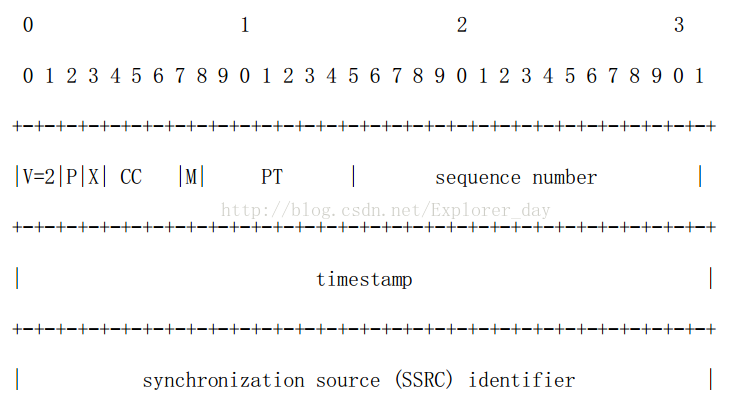
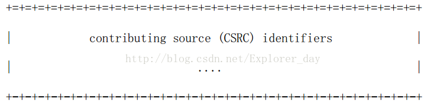
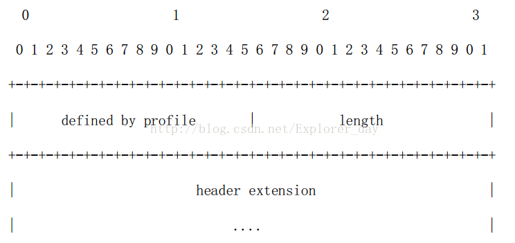
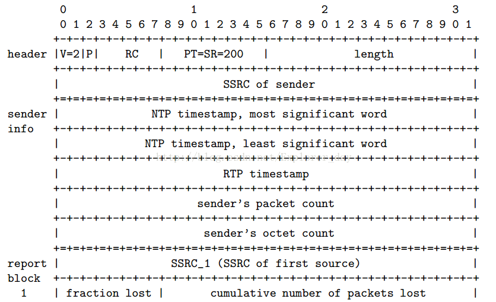
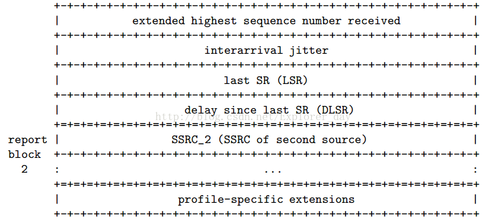
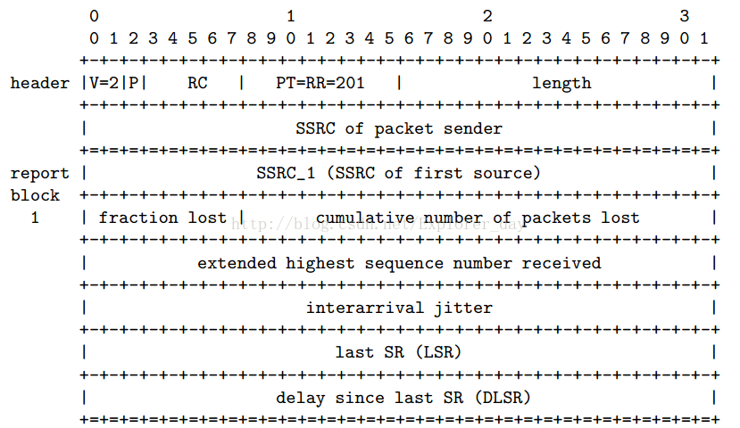
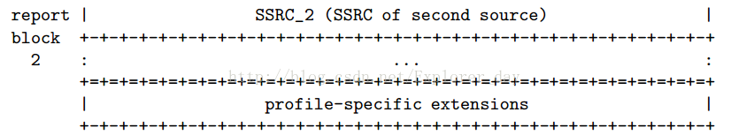
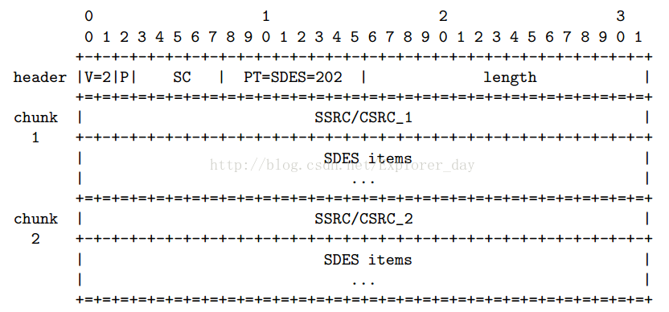
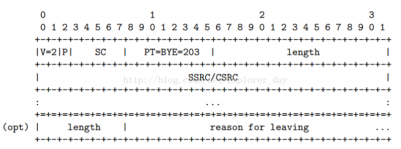
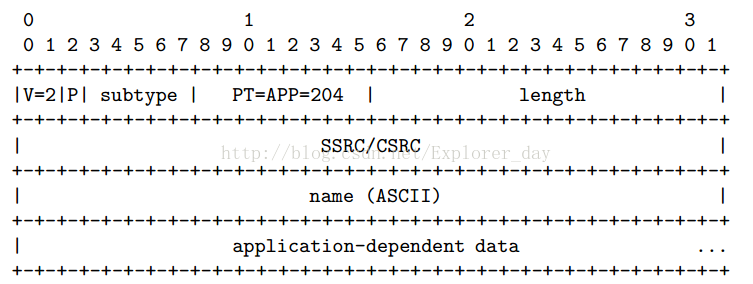

# 一、简介  

RTP—实时传输协议，其在多点传送（多播）或单点传送（单播）的网络上，提供端对端的网络传输功能，适合应用程序传输实时数据，如：音频，视频或者仿真数据。RTP没有为实时服务提供资源预留的功能，也不保证QoS（服务质量）。  

RTP的数据传输功能由一个控制协议（RTCP）来扩展，通过扩展，可以用一种方式对数据传输进行监测控制，该协议（RTCP）可以升级到大型的多点传输（多播）网络，并提供最小限度的控制和鉴别功能。RTP 和 RTCP 被设计成和下面的传输层和网络层无关。  

# 二、RTP使用场景  

1. 简单多播音频会议
2. 音频和视频会议
3. 混频器和转换器
4. 分层解码  

# 三、相关术语  

* RTP 负载（RTP payload）：通过 RTP传输的包中的数据，例如，音频样本或压缩好的视频数据。 
* RTP 包（RTP packet）：一种数据包，其组成部分有：一个固定 RTP 报头，一个可能为空的作用源（contributing sources）列表（见下文），以及负载数据。一些下层协议可能要 求对 RTP 包的封装进行定义。一般地，下层协议的一个包包含一个 RTP 包，但若封装方法允许，也可包含数个 RTP 包 。
*  RTCP 包（RTCP packet）：一种控制包，其组成部分有：一个类似 RTP 包的固定报头，后跟一个结构化的部分，该部分具体元素依不同 RTCP 包的类型而定。一般地，多个 RTCP 包将在一个下层协议的包中以合成 RTCP 包的形式传输；这依靠 RTCP 包的固定报头中的长度字段来实现。
*  端口（Port）： ―传输协议用来在同一主机中区分不同目的地的一种抽象。 TCP/IP 协议使用正整数来标识不同端口。 
* 传输地址(Transport address)：是网络地址与端口的结合，用来标识一个传输层次的终端，例如一个 IP 地址与一个 UDP 端口。
* RTP 媒体类型（RTP media type）：一个 RTP 媒体类型是一个单独 RTP 会话所载有的负载类型的集合。 RTP 配置文件把 RTP 媒体类型指派给 RTP 负载类型。 
* 多媒体会话（Multimedia session）：在一个参与者公共组中，并发的 RTP 会话的集合。 
* RTP 会话（RTP session）：一群参与者通过 RTP 进行通信时所产生的关联。 
* 同步源(SSRC， Synchronization source)： RTP 包流的源，用 RTP 报头中 32 位数值的SSRC 标识符进行标识，使其不依赖于网络地址。一个同步源的所有包构成了相同计时和序列号空间的一部分，这样接收方就可以把一个同步源的包放在一起，来进行重放。
* 作用源（CSRC， Contributing source )：若一个 RTP 包流的源，对由 RTP 混频器生成的组合流起了作用，则它就是一个作用源。 对特定包的生成起作用的源，其 SSRC 标识符组成 的列表，被混频器插入到包的 RTP 报头中。这个列表叫做 CSRC 表。
* 终端系统（End system)：一种应用程序，它产生发送出的 RTP 包中内容， 或者使用接收到的 RTP 包中内容。
* 混频器（Mixer)：一种中间系统，它从一个或多个源中接收 RTP 包，可能改变其数据格式，再按某种方式把这些包组合成一个新的包，然后转发出去。 
* 转换器（Translator)：一种中间系统，它转发 RTP 包而不改变各包的同步源标识符。 
* 监视器(Monitor)：一种应用程序，它接收 RTP 会话参与者所发送的 RTCP 包，特别是接收报告（reception report)，而且对当前服务质量进行评估，评估结果用于分配监视任务，故障诊断和长期统计。 
* 非 RTP 途径（Non-RTP means)：为提供一个可用的服务，可能还需要其他的协议和机制。   

# 四、RTP数据传输协议  

## 1、RTP固定头  
  
  

前 12 个字节出现在每个 RTP 包中，仅仅在被混合器插入时，才出现 CSRC 识别符列表。这些域有以下意义：  

* 版本(V)： 2 比特 此域定义了 RTP 的版本。此协议定义的版本是 2。版本(V)： 2 比特 此域定义了 RTP 的版本。此协议定义的版本是 2。
* 填充(P)： 1 比特 若填料比特被设置，则此包包含一到多个附加在末端的填充比特，填充比特不算作负载的一部分。填充的最后一个字节指明可以忽略多少个填充比特。填充可能用于某些具有固定长度的加密算法，或者用于在底层数据单元中传输多个 RTP 包。
* 扩展(X)： 1 比特 若设置扩展比特，固定头(仅)后面跟随一个头扩展。 
* CSRC 计数(CC)： 4 比特 CSRC 计数包含了跟在固定头后面 CSRC 识别符的数目。
* 标志(M)： 1 比特 标志的解释由具体协议规定。它用来允许在比特流中标记重要的事件，如帧边界。
* 负载类型(PT)： 7 比特 此域定义了负载的格式，由具体应用决定其解释。
* 序列号（sequence number）： 16 比特 每发送一个 RTP 数据包，序列号加 1，接收端可以据此检测丢包和重建包序列。序列号的初始值是随机的(不可预测)，以使即便在源本身不加密时(有时包要通过翻译器，它会这样做)，对加密算法泛知的普通文本攻击也会更加困难。
* 时间戳（timestamp）： 32 比特时间戳反映了 RTP 数据包中第一个字节的采样时间。时钟频率依赖于负载数据格式，并在描述文件（profile）中进行描述。也可以通过 RTP 方法对负载格式动态描述。
* SSRC： 32 比特 用以识别同步源。标识符被随机生成，以使在同一个 RTP 会话期中没有任何两个同步源有相同的 SSRC 识别符。
* CSRC 列表： 0 到 15 项，每项 32 比特 CSRC 列表识别在此包中负载的所有贡献源。 识别符的数目在 CC 域中给定。若有贡献源多于 15 个，仅识别 15 个。 CSRC 识别符由混合器插入，并列出所有贡献源的 SSRC 识别符。   

## 2、RTP头扩展  

RTP 提供扩展机制以允许实现个性化：某些新的与负载格式独立的功能要求的附加信息在RTP 数据包头中传输。设计此方法可以使其它没有扩展的交互忽略此头扩展。 RTP 头扩展的格式如下图所示。  
  

若 RTP 头中的扩展比特位置 1，则一个长度可变的头扩展部分被加到 RTP 固定头之后。头扩展包含 16 比特的长度域，指示扩展项中 32 比特字的个数，不包括 4 个字节扩展头(因此零是有效值)。 RTP 固定头之后只允许有一个头扩展。为允许多个互操作实现独立生成不同的头扩展，   或某种特定实现有多种不同的头扩展，扩展项的前 16 比特用以识别标识符或参数。这 16 比特的格式由具体实现的上层协议定义。基本的 RTP 说明并不定义任何头扩展本身。  

# 五、RTP控制协议RTCP  

## 1、RTCP包格式  

这部分定义了几个 RTCP 包类型，可以传送不同的控制信息：  

* SR：发送者报告，描述作为活跃发送者成员的发送和接收统计数字；
* RR：接收者报告，描述非活跃发送者成员的接收统计数字；
* SDES：源描述项，其中包括规范名 CNAME。
* BYE：表明参与者将结束会话。
* APP：应用描述功能。  

每个 RTCP 包的开始部分是与 RTP 数据包相类似的固定部分，随后是一块结构化单元，它随负载类型不同长度发生变化，但是总以 32 比特终止。对齐要求和长度域使 RTCP 包可"堆栈"，即可以将多个 RTCP 包形成一个复合 RTCP 包，在底层协议(如 UDP)中，通常都是将复合包作为一个包传输的。  

复合包中的每个 RTCP 单包可以单独处理，而无需考虑包复合的顺序。然而，为了实现某些协议功能，添加以下限制：   

* 接收数据的统计信息(在 SR 或 RR 中)。
* 新的参与者需要尽快接收一个源的规范名以识别数据源并与媒体建立会话。
* 必须限制首次在复合包中出现的包类型的数目，以增加在第一个字中常数比特的数目，这样可以增加 RTCP 包的有效性，以区分误传的 RTP 包和其他无关的包。  

因此，所有 RTCP 包必须以复合包的形式发送。复合包中至少有两个单个的 RTCP 包。具有以下格式：   

* 加密前缀：当且仅当复合包被加密时，对每个 RTCP 复合包加 32 比特的前缀。 
* SR 或 RR：复合包中的第一个 RTCP 包必须是一个报告包。即使没有数据发送和接收，此时发送空的 RR 包，或者复合包中其他的唯一包是 BYE 包，也必须发送报告包。 
* 附加的 RR：若被报告的接收统计源数目超过 SR/RR 包中最大允许的 31 个，附加的 RR必须跟在最初的报告包后面。
* 源描述 SDES
* BYE 或 APP 包  

## 2、发送者和接受者报告  

RTP 接收者利用 RTCP 报告包提供接收质量反馈。根据接收者是否同时还是发送者， RTCP包采取两种不同的形式。发送者报告(SR)和接收者报告(RR)格式中唯一的不同，除包类型码之外，在于发送者报告包括 20 字节的发送者信息。   

SR 包和 RR 包都包括零到多个接收报告块。针对该接收者发出上一个报告块后接收到 RTP包的起始同步源，每个源一个块。报告不发送给 CSRC 列表中的贡献源。每个接收报告块提供从特定数据源接收到数据的统计信息。由于 SR/RR 包最多允许 31 个接收报告块，故可以在最初的 SR 或 RR 包之后附加 RR 包，以包含从上一个报告以来的间隔内收听到的所有源的接收报告。如果数据源太多，致使若把所有的 RR 包放到同一个 RTCP 复合包中会超出网络的 MTU。那么就在一个周期内选择上面 RR 包的一部分以不超过 MTU。这些 RR 包的选取应让各个包都有同等的几率被取到。这样在几个发送周期间隔中，对所有的数据源就都发送接收报告了。  

### 1）、发送者报告RTCP包  
  
  

发送者报告包由 3 部分组成，若定义，可能跟随第 4 个面向协议的扩展部分。  

第一部分，头部， 8 字节长。该域有以下意义：  

* 版本(V)： 2 比特 RTP 版本识别符，在 RTCP 包内的意义与 RTP 包中的相同。此协议中定义的版本号为 2。
* 填充(P)： 1 比特 若设置填充比特，该 RTCP 包在末端包含一些附加填充比特，并不是控制信息的基本部分。填充的最后一个比特统计了多少个字节必须被忽略。填充可能会用于需要固定长度块的加密算法。在复合 RTCP 包中，复合包作为一个整体加密，填料比特只能加在最后一个单个 RTCP 包的后面。
* 接收报告块计数(RC)： 5 比特 该包中所含接收报告块的数目。零值有效。
* 包类型(PT)： 8 比特 包含常数 200，用以识别这个为 SR 包。
* 长度： 16 比特 该 RTCP 包的长度减 1。其单位是 32 比特字，包括头和任何填充字节。
* SSRC： 32 比特 SR 包发送者的同步源标识符。  

第二部分，发送者信息， 20 字节长。在每个发送者报告包中出现。它概括了从此发送者发出的数据传输情况。此域有以下意义：  

* NTP 时间戳： 64 比特 指示了此报告发送时的背景时钟（wallclock）时刻，它可以与从其它接收者返回的接收报告块中的时间标志结合起来，计算往返每个接收者所花的时间。 
* RTP 时间戳： 32 比特 与以上的 NTP 时间标志对应同一时刻。与数据包中的 RTP 时间戳具有相同的单位和偏移量。
* 发送的报文数： 32 比特 从开始传输到此 SR 包产生时该发送者发送的 RTP 数据包总数。若发送者改变 SSRC 识别符，该计数器重设。
* 发送的字节文数： 32 比特 从开始传输到此 SR 包产生时该发送者在 RTP 数据包发送的字节总数(不包括头和填充)。若发送者改变 SSRC 识别符，该计数器重设。此域可以用来估计平均的负载数据发送速率。  

第三部分：零到多个接收报告块。块数等于从上一个报告以来该发送者侦听到的其它源（不包括自身）的数目。每个接收报告块传输从某个同步源来的数据包的接收统计信息。若数据源因冲突而改变其 SSRC 标识符，接收者重新设置统计信息。这些统计信息有：   

* SSRC_n(同步源标识符)： 32 比特 在此接收报告块中信息所属源的 SSRC 标识符。
* 丢包率： 8 比特 自从前一 SR 包或 RR 包发送以来，从 SSRC_n 传来的 RTP 数据包的丢失比例。以定点小数的形式表示。该值定义为损失包数／期望接收的包数。若由于包重复而导致包丢失数为负值，丢包率设为零。注意在收到上一个包后，接收者无法知道以后的包是否丢失。
* 累计包丢失数： 24 比特 从开始接收到现在，从源 SSRC_n 发到本源的 RTP 数据包的丢包总数。该值定义为：期望接收的包数－实际接收的包数。接收的包括复制的或迟到的。由于迟到的包不算作损失，在发生复制时丢包数可能为负值。期望接收的包数定义为：扩展的上一接收序号(随后定义)减去最初接收序号。
* 接收到的扩展的最高序列号： 32 比特 低 16 比特包含从源 SSRC_n 来的最高接收序列号，高 16 比特用相应的序列号周期计数器扩展该序列号。注意在同一会议中的不同接收者，若启动时间明显不同，将产生不同的扩展项。
* 到达间隔抖动：32 比特 RTP 数据包到达时刻统计方差的估计值。测量单位同时间戳单位，用无符号整数表达。到达时间抖动定义为一对包中接收者相对发送者的时间间隔差值的平均偏差(平滑后的绝对值)。
* 上一 SR 报文 (LSR)： 32 比特 接收到的来自源 SSRC_n 的最新 RTCP 发送者报告(SR)的 64 位 NTP 时间标志的中间 32 位。若还没有接收到 SR，该域值为零。
* 自上一 SR 的时间(DLSR)： 32 比特 是从收到来自 SSRC_n 的 SR 包到发送此接收报告块之间的延时，以 1/65536 秒为单位。若还未收到来自 SSRC_n 的 SR 包，该域值为零。  

### 2）、RR：接收者报告包   

  
  

接收者报告包(RR)与发送者报告包基本相同，除了包类型域包含常数 201 和没有发送者信息的 5 个字(NTP 和 RTP 时间标志和发送者包和字节计数)。余下区域与 SR 包意义相同。若没有发送和接收据报告，在 RTCP 复合包头部加入空的 RR 包(RC=0)。  

### 3）、发送者和接收者报告扩展   

如果有额外的关于发送者和接收者的信息要周期性的，描述文件（profile）应该定义接收者报告和发送者报告描述文件扩展。此时，应采用这里的办法，而不是定义另外的 RTCP 包。因为这种办法需要的头部信息更少。  

扩展部分是发送报告包和接收报告包的第四部分。如果有的话，应紧跟在接收报告块的后面。如果需要更多的发送者信息，它应当跟在发送者报告的开关，而不应在报告中出现。如果要包含进接收者的信息，它应该以块数组的方式放到接收报告块的后面。即这些块也应被计入 RC 字段中。  

## 3、源描述 RTCP 包   

源描述（SDES）包由一个头及 0 个或多个块组成。每个块都由块中所标识的数据源的标识符及其后的各个描述构成。  
  

## 4、BYE（BYE 包）  

  

BYE 包表明一个或多个源将要离开。如果混合器收到 BYE 包，混合器应当发送这个 BYE 包，并保持 SSRC/CSRC 不变。如果混合器关闭，应向贡献源列表中的所有 SSRC，包括它自己的SSRC 发送 BYE 包。 BYE 包可能会有选择的包含 8 个字节的统计字段，其后跟上几个字节的文本表明离开的原因。文本字符串编码格式和 SDES 中描述的相同。  

## 5、APP：应用定义RTCP包  

  
