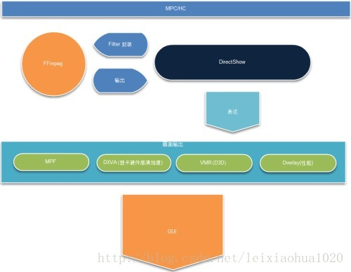
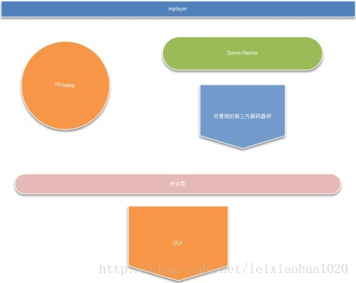
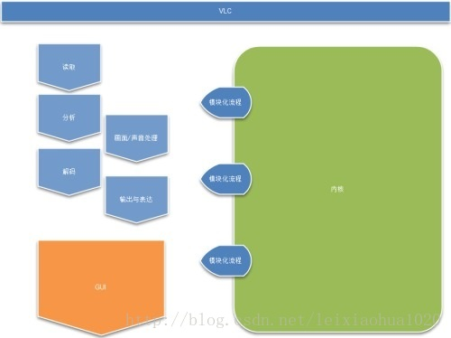

媒体播放工具，这里主要指视频播放，因为要面临庞大的兼容性和纷繁复杂的算法，从架构上看，能脱颖而出的体系屈指可数。大体来说业界主要有3大架构：MPC、MPlayer和VLC。这3大架构及其衍生品占领了90%的市场，凡是用户能看到的免费媒体播放软件，无一不是源自这3大架构。   

#### MPC-HC架构   

MPC（Media Player Classic）和它的后续者MPC-HC应该并列而说。MPC基于DirectShow架构，是Windows系统下元祖级别的播放器。包括KMP之流最早也就是抄来MPC的代码再换个界面。MPCHC则在MPC的原作者Gabest渐渐退出开发后的继承者，MPCHC有很多创新特性，包括开始融入ffmpeg和支持更多DirectX特性和DXVA等等。  
  

优点：更直接的支持DXVA，对一些稀奇古怪的Windows平台上的格式可以通过调用第三方的Filter组件等，拥有更好的兼容性   

缺点：有人说DirectShow是Windows中最难掌握的SDK，开发复杂；DirectShow允许第三方封装的特点也让兼容性和稳定性问题复杂化；第三方Filter出现异常时非常难以分析处理，更难以复用；  

射手播放器的架构主要来自MPC-HC，但更多的融合了FFmpeg的优势，对DirectShow Filter进行了多处改写，大大加强了对ffmpeg的利用，提高了解码稳定性，同时扩展了解码能力和兼容性。   

#### mplayer架构   

如果说MPC是Windows上的元祖，那么mplayer就是linux上媒体播放的元祖了。mplayer使用ffmpeg作为解码核心，也是与ffmpeg结合最紧密的项目，ffmpeg的代码就是由mplayer来host，开发者群也有非常大的交集。借助linux开发/使用者的强大实力，mplayer建立了要比DirectShow稳定的多的工作流程。超越ffmpeg本身的功能外，后来又通过反向工程使之可以调用Windows上的DirectShow Filter DLL，让mplayer架构越来越吸引人，成为兼具稳定性和性能的优秀作品。    
  

优点：稳定，兼容性也可以说相当不错   

缺点：代码结构不清晰；纯C语言开发，难于阅读；显卡硬件加速还需要越过更多障碍   

#### VLC架构   

VLC是个后起之秀，开发速度的进展可以说是一只奇葩。虽然同样基于ffmpeg，但可能是相对于“左三年右三年缝缝补补又三年”的mplayer架构来说，VLC的架构在设计之初就很好的考虑到模块化开发，所以使它更吸引年轻的开发人员。成为近年发展非常快的架构。   

  

优点：稳定，兼容性也可以说相当不错   

缺点：纯C语言开发，难于阅读；硬件加速略有障碍   

很多人都会发现，3大架构中都可以看到ffmpeg的名字。 说起ffmpeg，那真是”One Ring to rule them all，One Ring to find them, One Ring to bring them all“。在#ffmpeg有人和我说过，想不用ffmpeg去写媒体播放器，就像是造汽车而不用车轮。但是ffmpeg本身仅作为命令行工具或类库（常见的如libavcodec）出现。终端用户很少能直接接触到ffmpeg，所以知名度也较小。ffmpeg的详细架构，下次有时间时再续……   

*注1：所有优缺点均仅针对架构本身而言   

*注2：文中观点为个人意见，仅供参考