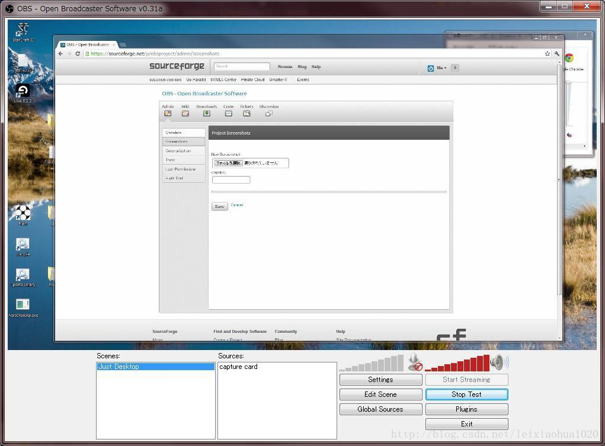

无意间发现了一个非常优秀的开源流媒体系统：OBS ( Open Broadcaster Software )   

项目主页：http://sourceforge.net/projects/obsproject/  

运行截图：  
  

该软件是基于MFC的，下载源码后一次性就可以编译通过，使用很简单。  

使用了以下开源库：  

  x264                   - H.264编码库  
  libmp3lame             - MP3编码库  
  libfaac                - AAC编码库  
  librtmp                - RTMP协议工具库  
  libsamplerate          -音频重采样库  

英文介绍原文：  
Open Broadcaster Software is free and open source software for the purposes of streaming live media content to the internet or to video files.  

Originally I just made it for myself because I thought "why should I pay a subscription for software I could probably write myself?"  

..And so, I did. And it evolved into somewhat of a monster of a project. And that's pretty much the end of the story.  

I hope people can make use of this application, or otherwise learn something from it. I'm having a ton of fun writing this software and am learning much in the process. Overall it's been an excellent experience.  

This project is free and licensed under the GNU General Public License v2.  

