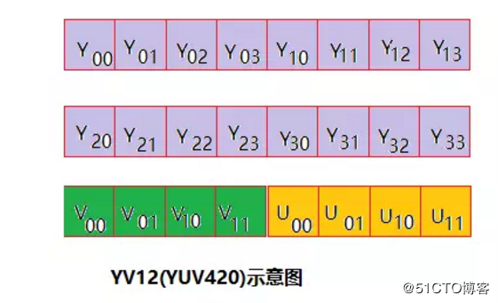
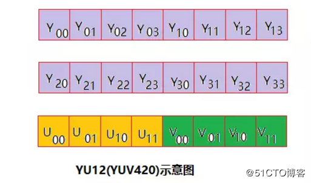
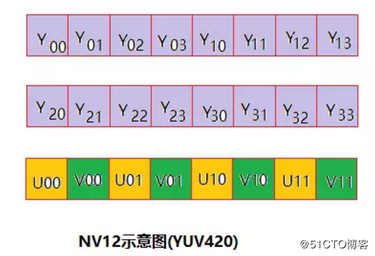
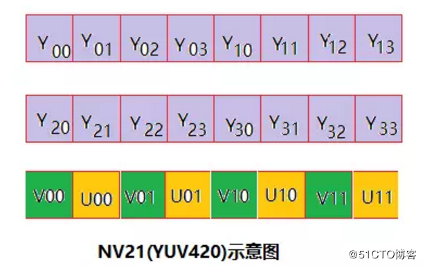
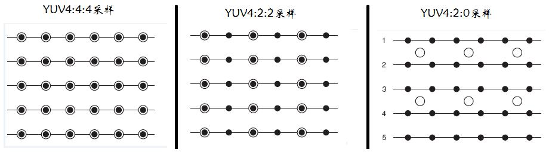
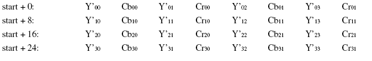
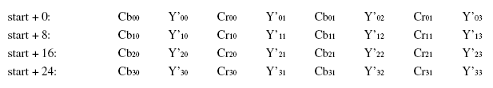
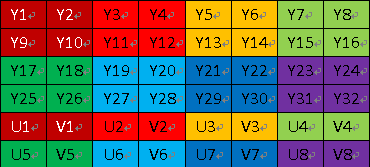
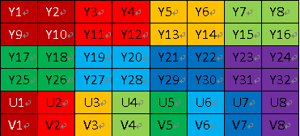

来源：https://blog.csdn.net/lucky_greenegg/article/details/9942619
YUV，是一种颜色编码方法。常使用在各个视频处理组件中。 YUV在对照片或视频编码时，考虑到人类的感知能力，允许降低色度的带宽。  

YUV是编译true-color颜色空间（color space）的种类，Y'UV, YUV, YCbCr，YPbPr等专有名词都可以称为YUV，彼此有重叠。“Y”表示明亮度（Luminance或Luma），也就是灰阶值，“U”和“V”表示的则是色度（Chrominance或Chroma），作用是描述影像色彩及饱和度，用于指定像素的颜色。  

# 历史  

Y'UV的发明是由于彩色电视与黑白电视的过渡时期。黑白视频只有Y（Luma，Luminance）视频，也就是灰阶值。到了彩色电视规格的制定，是以YUV/YIQ的格式来处理彩色电视图像，把UV视作表示彩度的C（Chrominance或Chroma），如果忽略C信号，那么剩下的Y（Luma）信号就跟之前的黑白电视频号相同，这样一来便解决彩色电视机与黑白电视机的兼容问题。Y'UV最大的优点在于只需占用极少的带宽。  

因为UV分别代表不同颜色信号，所以直接使用R与B信号表示色度的UV。也就是说UV信号告诉了电视要偏移某象素的的颜色，而不改变其亮度。或者UV信号告诉了显示器使得某个颜色亮度依某个基准偏移。UV的值越高，代表该像素会有更饱和的颜色。  

彩色图像记录的格式，常见的有RGB、YUV、CMYK等。彩色电视最早的构想是使用RGB三原色来同时传输。这种设计方式是原来黑白带宽的3倍，在当时并不是很好的设计。RGB诉求于人眼对色彩的感应，YUV则着重于视觉对于亮度的敏感程度，Y代表的是亮度，UV代表的是彩度（因此黑白电影可省略UV，相近于RGB），分别用Cr和Cb来表示，因此YUV的记录通常以Y:UV的格式呈现。   

# YUV基本概念  

Y′UV,YUV,YCbCr,YPbPr所指涉的范围，常有混淆或重叠的情况。从历史的演变来说，其中YUV和Y'UV通常用来编码电视的模拟信号，而YCbCr则是用来描述数字的视频信号，适合视频与图片压缩以及传输，例如MPEG、JPEG。但在现今，YUV通常已经在电脑系统上广泛使用。  

Y'代表明亮度(luma;brightness)而U与V存储色度(色讯;chrominance;color)部分;亮度(luminance)记作Y，而Y'的prime符号记作伽玛校正。  

YUVFormats分成两个格式：  

* 紧缩格式（packedformats）：将Y、U、V值存储成MacroPixels数组，和RGB的存放方式类似。
* 平面格式（planarformats）：将Y、U、V的三个分量分别存放在不同的矩阵中。  
* 半平面格式YUV:介入上面两种格式的一种中间格式.Y分量单独存储，但是UV分量交叉存储。eg YYYYUVUV,代表格式有NV12 NV21.，后缀是SP，YUV420SP。  


紧缩格式（packedformat）中的YUV是混合在一起的，对于YUV4:4:4格式而言，用紧缩格式很合适的，因此就有了UYVY、YUYV等。  
平面格式（planarformats）是指每Y分量，U分量和V分量都是以独立的平面组织的，也就是说所有的U分量必须在Y分量后面，而V分量在所有的U分量后面，此一格式适用于采样（subsample）。平面格式（planarformat）有I420（4:2:0）、YV12、IYUV等。  

## 存储示意图  

* Three plane: Y, U, V分别存储，分别对应一个plane,统称为YUV420P格式  
      

* Two plane: Y和UV分别存储，Y对应一个plane, UV对应一个plane，统称为YUV420SP格式  
      


# YUV三种采样格式  

为节省带宽起见，大多数YUV格式平均使用的每像素位数都少于24位。主要的抽样（subsample）格式有YCbCr4:2:0、YCbCr4:2:2、YCbCr4:1:1和YCbCr4:4:4。YUV的表示法称为A:B:C表示法：  

* 4:4:4表示完全取样。
* 4:2:2表示2:1的水平取样，垂直完全采样。
* 4:2:0表示2:1的水平取样，垂直2：1采样。
* 4:1:1表示4:1的水平取样，垂直完全采样。  

最常用Y:UV记录的比重通常1:1或2:1，DVD-Video是以YUV4:2:0的方式记录，也就是我们俗称的I420，YUV4:2:0并不是说只有U（即Cb）,V（即Cr）一定为0，而是指U：V互相援引，时见时隐，也就是说对于每一个行，只有一个U或者V分量，如果一行是4:2:0的话，下一行就是4:0:2，再下一行是4:2:0...以此类推。至于其他常见的YUV格式有YUY2、YUYV、YVYU、UYVY、AYUV、Y41P、Y411、Y211、IF09、IYUV、YV12、YVU9、YUV411、YUV420等。  

 YUV码流的存储格式其实与其采样的方式密切相关，主流的采样方式有三种，YUV4:4:4，YUV4:2:2，YUV4:2:0，关于其详细原理，可以通过网上其它文章了解，这里我想强调的是如何根据其采样格式来从码流中还原每个像素点的YUV值，因为只有正确地还原了每个像素点的YUV值，才能通过YUV与RGB的转换公式提取出每个像素点的RGB值，然后显示出来。  
 
用三个图来直观地表示采集的方式吧，以黑点表示采样该像素点的Y分量，以空心圆圈表示采用该像素点的UV分量。  
  

先记住下面这段话，以后提取每个像素的YUV分量会用到。  

* YUV 4:4:4采样，每一个Y对应一组UV分量。
* YUV 4:2:2采样，每两个Y共用一组UV分量。 
* YUV 4:2:0采样，每四个Y共用一组UV分量。   


## 存储方式  
 下面我用图的形式给出常见的YUV码流的存储方式，并在存储方式后面附有取样每个像素点的YUV数据的方法，其中，Cb、Cr的含义等同于U、V。  

### （1）YUVY 格式 （属于YUV422）  
  

YUYV为YUV422采样的存储格式中的一种，相邻的两个Y共用其相邻的两个Cb、Cr，分析，对于像素点Y’00、Y’01 而言，其Cb、Cr的值均为 Cb00、Cr00，其他的像素点的YUV取值依次类推。  

### （2） UYVY 格式 （属于YUV422）  
  
UYVY格式也是YUV422采样的存储格式中的一种，只不过与YUYV不同的是UV的排列顺序不一样而已，还原其每个像素点的YUV值的方法与上面一样。  

### （3） YUV422P（属于YUV422）  
YUV422P也属于YUV422的一种，它是一种Plane模式，即平面模式，并不是将YUV数据交错存储，而是先存放所有的Y分量，然后存储所有的U（Cb）分量，最后存储所有的V（Cr）分量，如上图所示。其每一个像素点的YUV值提取方法也是遵循YUV422格式的最基本提取方法，即两个Y共用一个UV。比如，对于像素点Y’00、Y’01 而言，其Cb、Cr的值均为 Cb00、Cr00。  

### （4）YV12，YU12格式（属于YUV420）  
YU12和YV12属于YUV420格式，也是一种Plane模式，将Y、U、V分量分别打包，依次存储。其每一个像素点的YUV数据提取遵循YUV420格式的提取方式，即4个Y分量共用一组UV。注意，上图中，Y’00、Y’01、Y’10、Y’11共用Cr00、Cb00，其他依次类推。  

### （5）NV12、NV21（属于YUV420）  
NV12和NV21属于YUV420格式，是一种two-plane模式，即Y和UV分为两个Plane，但是UV（CbCr）为交错存储，而不是分为三个plane。其提取方式与上一种类似，即Y’00、Y’01、Y’10、Y’11共用Cr00、Cb00  


## 例子  
YUV420 planar数据， 以720×488大小图象YUV420 planar为例，其存储格式是： 共大小为(720×480×3>>1)字节，分为三个部分:Y,U和V  

Y分量：    (720×480)个字节    
U(Cb)分量：(720×480>>2)个字节  
V(Cr)分量：(720×480>>2)个字节  

三个部分内部均是行优先存储，三个部分之间是Y,U,V 顺序存储。  

即YUV数据的0－－720×480字节是Y分量值，           
720×480－－720×480×5/4字节是U分量  
720×480×5/4 －－720×480×3/2字节是V分量。  

### 4 ：2： 2 和4：2：0 转换：  
最简单的方式：  
YUV4:2:2 ---> YUV4:2:0  Y不变，将U和V信号值在行(垂直方向)在进行一次隔行抽样。   
YUV4:2:0 ---> YUV4:2:2  Y不变，将U和V信号值的每一行分别拷贝一份形成连续两行数据。  

在YUV420中，一个像素点对应一个Y，一个4X4的小方块对应一个U和V。对于所有YUV420图像，它们的Y值排列是完全相同的，因为只有Y的图像就是灰度图像。YUV420sp与YUV420p的数据格式它们的UV排列在原理上是完全不同的。420p它是先把U存放完后，再存放V，也就是说UV它们是连续的。而420sp它是UV、UV这样交替存放的。(见下图) 有了上面的理论，我就可以准确的计算出一个YUV420在内存中存放的大小。 width * hight =Y（总和） U = Y / 4   V = Y / 4，所以YUV420 数据在内存中的长度是 width * hight * 3 / 2，假设一个分辨率为8X4的YUV图像，它们的格式如下图( YUV420sp格式如下图        )：  
  

  YUV420p数据格式如下图  
    

旋转90度的算法:  

```c
public static void rotateYUV240SP(byte[] src,byte[] des,int width,int height)
{
  int wh = width * height;
  //旋转Y
  int k = 0;
  for(int i=0;i<width;i++) {
   for(int j=0;j<height;j++)
   {
      des[k] = src[width*j + i];
      k++;
   }
  }

  for(int i=0;i<width;i+=2) {
   for(int j=0;j<height/2;j++)
   {
        des[k] = src[wh+ width*j + i]; 
        des[k+1]=src[wh + width*j + i+1];
        k+=2;
    }
  }
}
```


YV12和I420的区别        一般来说，直接采集到的视频数据是RGB24的格式，RGB24一帧的大小size＝width×heigth×3 Bit，RGB32的size＝width×heigth×4，如果是I420（即YUV标准格式4：2：0）的数据量是 size＝width×heigth×1.5 Bit。       在采集到RGB24数据后，需要对这个格式的数据进行第一次压缩。即将图像的颜色空间由RGB2YUV。因为，X264在进行编码的时候需要标准的YUV（4：2：0）。但是这里需要注意的是，虽然YV12也是（4：2：0），但是YV12和I420的却是不同的，  
在存储空间上面有些区别:  
 YV12 ： 亮度（行×列） ＋ U（行×列/4) + V（行×列/4）  
 I420 ： 亮度（行×列） ＋ V（行×列/4) + U（行×列/4）  
 **可以看出，YV12和I420基本上是一样的，就是UV的顺序不同。**  

继续我们的话题，经过第一次数据压缩后RGB24－>YUV（I420）。这样，数据量将减少一半，为什么呢？呵呵，这个就太基础了，我就不多写了。同样，如果是RGB24－>YUV（YV12），也是减少一半。但是，虽然都是一半，如果是YV12的话效果就有很大损失。然后，经过X264编码后，数据量将大大减少。将编码后的数据打包，通过RTP实时传送。到达目的地后，将数据取出，进行解码。完成解码后，数据仍然是YUV格式的，所以，还需要一次转换，这样windows的驱动才可以处理，就是YUV2RGB24。YUY2  是 4:2:2  [Y0 U0 Y1 V0]  

## yuv420p 和 YUV420的区别 在存储格式上有区别  

yuv420p：yyyyyyyy uuuuuuuu vvvvv   
yuv420： yuv yuv yuv  

 YUV420P，Y，U，V三个分量都是平面格式，分为I420和YV12。I420格式和YV12格式的不同处在U平面和V平面的位置不同。在I420格式中，U平面紧跟在Y平面之后，然后才是V平面（即：YUV）；但YV12则是相反（即：YVU）。YUV420SP, Y分量平面格式，UV打包格式, 即NV12。 NV12与NV21类似，U 和 V 交错排列,不同在于UV顺序。  

* I420: YYYYYYYY UU VV    =>YUV420P
* YV12: YYYYYYYY VV UU    =>YUV420P
* NV12: YYYYYYYY UVUV     =>YUV420SP
* NV21: YYYYYYYY VUVU     =>YUV420SP  

YUV是指亮度参量和色度参量分开表示的像素格式，而这样分开的好处就是不但可以避免相互干扰，还可以降低色度的采样率而不会对图像质量影响太大。YUV是一个比较笼统地说法，针对它的具体排列方式，可以分为很多种具体的格式。  
