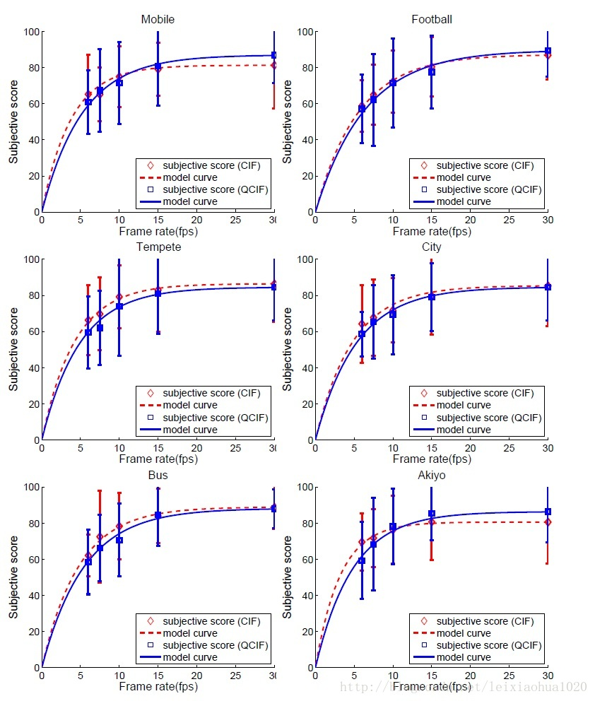
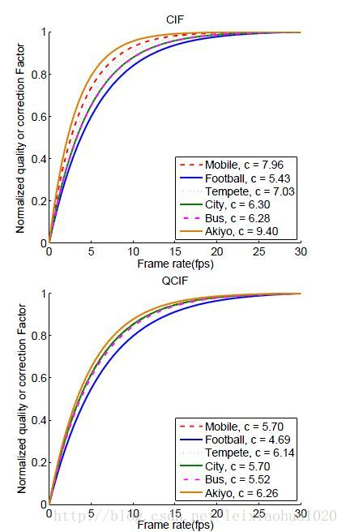

Yen-Fu Ou等人在论文《MODELING THE IMPACT OF FRAME RATE ON PERCEPTUAL QUALITY OF VIDEO》中研究了帧率对人眼主观感受的影响。他们使用了6种内种不同的序列进行了测试，每种内容包含两个分辨率：CIF（352×288）和QCIF（176×144）。他们的实验结果如下图所示：  
  

该图反映了帧率和人眼主观感受之间的关系。6个测试序列分别使用6张图表示。每张图x坐标代表帧率，y坐标代表人眼主观感受（MOS），红色虚线代表CIF（352×288）分辨率序列的拟合曲线，蓝色虚线代表QCIF（176×144）分辨率序列的拟合曲线。主观感受取值范围0-100，数值越大代表主观感受越好。  

通过该图我们可以看出，当帧率大于15帧的时候，人眼的主观感受差别不大，基本上都处于较高的水平。而帧率小于15帧以后，人眼的主观感受会急剧下降。换句话说，人眼会立刻感受到画面的不连贯性。因此可以认为15帧是一个临界值。视频的帧率不宜小于15帧。  

下图是Yen-Fu Ou等人给出的上图的统计结果，注意他们把主观感受分（MOS）做了归一化处理：  
  

由图可见，帧率对视频质量的影响根据视频内容的不同而不同。视频内容越复杂，对帧率的要求越高。比如说“football”就是一个运动较复杂的视频序列，可见在同等视频质量的情况下，它需要更高的帧率。而“Akiyo”内容则是一个新闻女主播在播新闻，画面内容简单，在较低的帧率下也能获得较高的视频质量。  
