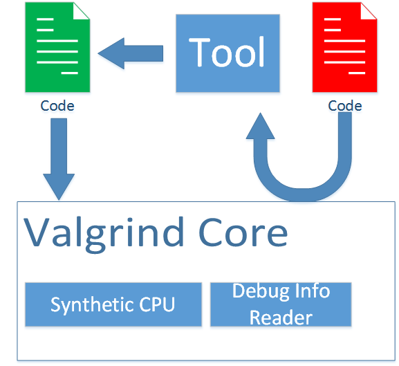
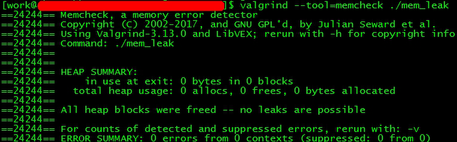
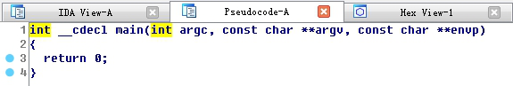
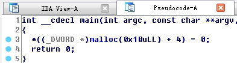
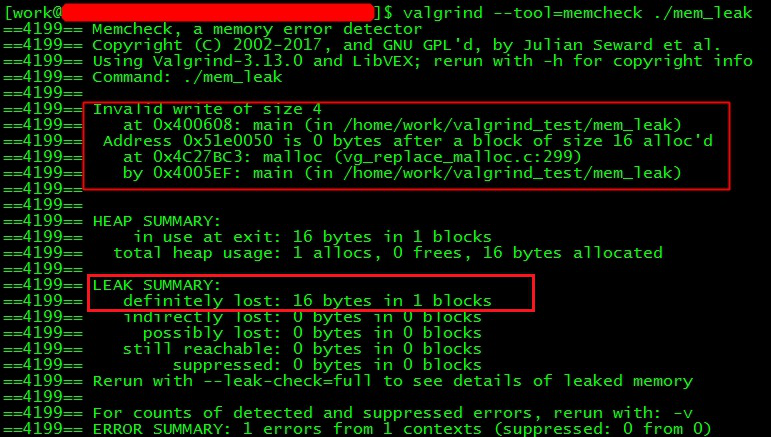
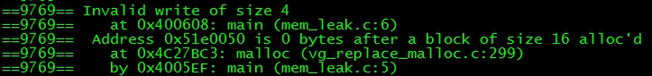
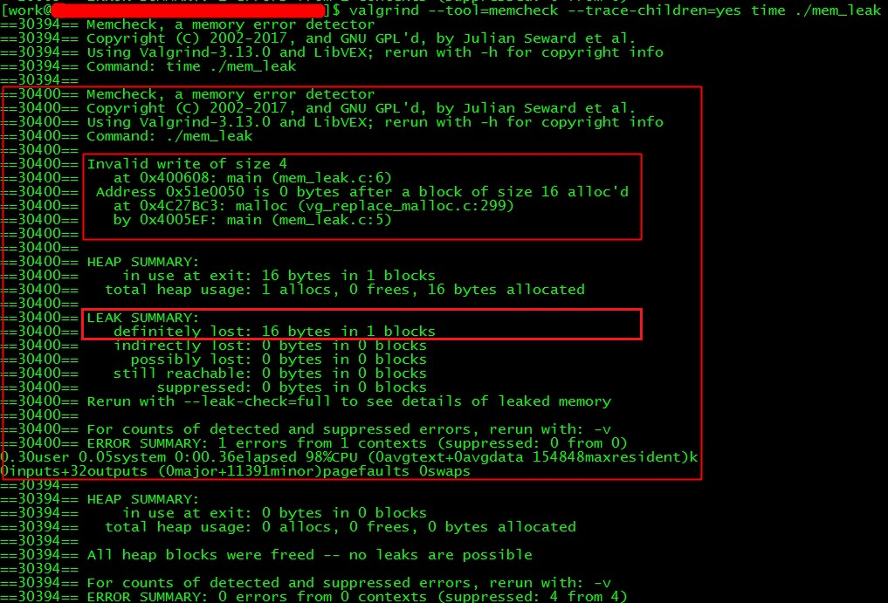

&emsp;&emsp; [valgrind](http://valgrind.org/downloads/repository.html)是一个知名的分析软件集。我们可以使用它进行内存、多线程及性能等各种问题的分析。它采用非侵入方式，所谓非侵入方式是指：我们不用在代码中插入分析工具的库。这对于开发者来说是友好的。因为如果要将工具编译到文件中，或者要调用其提供的一些API，才能进行问题分析，无疑增大了用户的学习和使用成本。  
```bash
valgrind [valgrind-options] your-prog [your-prog-options]  
```
&emsp;&emsp;当我们需要分析一款软件时，只要采用上面格式的调用。其中your-prog是被分析的程序文件路径，your-prog-options是原本要传递给待分析程序的参数。valgrind-options是valgrind的一些参数，最常用的是--tool=【tool_name】。我们可以使用不同的tool进行不同的分析，比如使用memcheck进行内存问题分析。  
```bash
valgrind --tool=memcheck ls -l  
```
&emsp;&emsp;那么valgrind和memcheck到底是什么关系呢？我们可以通过下图表达出  
  
&emsp;&emsp;当待分析程序片段第一次被执行时，valgrind会将代码片段交给工具——比如内存调试时使用的memcheck处理，工具会在代码中插入一些辅助分析的代码片段。新的代码会在valgrind模拟出的CPU上执行。然后valgrind会结合之前读取到的待执行程序和其所关联的库文件的调试信息，输出分析结果。  
&emsp;&emsp;因为有新插入的代码逻辑，valgrind运行下的程序都比其独立运行时要慢。视选择的工具不同，其效率可能是正常值的1/4~1/50。所以使用valgrind做性能分析时，一般不使用绝对数据，而使用相同环境下的相对数据进行对比。  
&emsp;&emsp;为了让valgrind读取出准确的调试信息，待分析程序最好**使用-O0禁止编译器优化**，以及**使用-g让编译器把行号信息编入到文件中**。比如对于下面的代码  
```c++
#include <stdlib.h>  
  
int main() {  
    const int array_count = 4;  
    int* p = malloc(array_count * sizeof(int));  
    p[array_count] = 0;  
    return 0;  
}  
```
&emsp;&emsp;如果我们使用O2参数让编译器去做优化  

```bash
gcc -O2 mem_leak.c -o mem_leak  
```
&emsp;&emsp;编译器会认为4~6行是没有意义的，于是被优化了。于是使用valgrind分析不出代码的问题  
  
&emsp;&emsp;这并不是valgrind的错误，因为编译器的确编译出了一个空的main函数。我们可以用IDA反编译看看  
  
&emsp;&emsp;所以我们要使用O0禁止编译优化  
```bash
gcc -O0 mem_leak.c -o mem_leak  
```
 &emsp;&emsp;此时编译出来的二进制代码可以被解读为  
   
   
&emsp;&emsp;此时使用valgrind分析，可以看到它给出内存写违例和内存泄露的报告。  
  

&emsp;&emsp;但是它没有告诉我们哪行出错了，于是我们要加上-g编译参数  
```bash
gcc -g -O0 mem_leak.c -o mem_leak  
```
&emsp;&emsp;这样我们可以看到第6行导致写违例。  
  
&emsp;&emsp;有时候，待分析的程序会启动子程序。如果我们希望分析子程序，则需要增加--trace-children=yes。比如我们使用time启动上面的程序  
  
&emsp;&emsp; 可以看出，valgrind分析出作为父程序的time是没有问题的，但是作为子程序的mem_leak有两个错误。